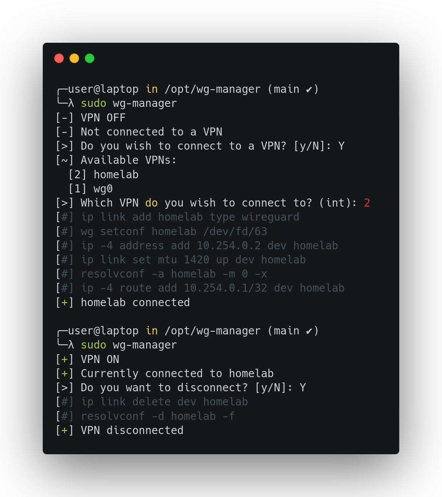

<br />
<div align="center">
  <a href="https://github.com/bWlrYQ/wg-manager">
    
  </a>

  <h3 align="center">WireGuard Manager</h3>

  <p align="center">
    A simple shell script that allows you to manage all your WireGuard VPN tunnels in one place.
    <br />
    <a href="https://github.com/bWlrYQ/wg-manage/issues/new?labels=bug&template=bug-report---.md">Report Bug</a>
    ·
    <a href="https://github.com/bWlrYQ/wg-manage/issues/new?labels=enhancement&template=feature-request---.md">Request Feature</a>
  </p>
</div>

## Description

This script aims to manage WireGuard VPN tunnels on a host that often needs to switch VPN because `wg-quick <up/down> wg-qucik@<if>.service` takes too much time 🕰️. The only thing you have to do is manage your list of VPN tunnels in `vpn_config.sh`.

<div align="center">
  
</div>

## Installation 
1. Clone the repository into `/opt`  
```bash
git clone https://github.com/bWlrYQ/wg-manager /opt/wg-manager
```
2. Change script permissions  
```bash
sudo chmod 711 /opt/wg-manager/vpn.sh
```
3. Create a symbolic link in `/usr/bin`
```bash
sudo ln -sv /opt/wg-manager/vpn.sh /usr/bin/wg-manager
```
4. Create a `vpn_config.sh` file
```bash
sudo touch /opt/wg-manager/vpn_config.sh && sudo chmod 711 /opt/wg-manager/vpn_config.sh
```
5. Add your VPN list array in `vpn_config.sh`
```bash
bash -c 'cat << EOF > /opt/wg-manager/vpn_config.sh
#!/bin/bash

declare -A VPNS=(
    ["1"]="wg0:/etc/wireguard/wg0.conf"
    ["2"]="company-internal:/home/user/Documents/company-internal.conf"
    ["3"]="homelab:/etc/wireguard/homelab.conf"
    #["4"]="foo:/bar/foo.conf"
)
EOF'
```

## Usage 
 
Simply launch the script using `sudo wg-manager` and answer the prompts accordingly to your needs, KISS. 

## License

Distributed under the GNU GPL V3.0 License. See `LICENSE` for more information.
